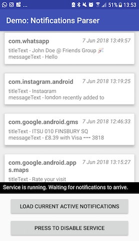

# Notifications Parser Component


[ ](https://bintray.com/chattylabs/maven/notifications-parser/_latestVersion)
[](https://github.com/chattylabs/android-sdk-notifications-parser/blob/master/LICENSE)

Android SDK that allows you to retrieve the current active notifications and let you listen for incoming new ones.

<p align="center"></p>

## Why choosing this SDK?

The **Notifications Parser Component SDK** contains built-in model algorithms that parse and extract the principal information from several instant messages apps and other installed apps. 

It aims to deliver a reliable solution easy to integrate in a project, that measures and takes care of aspects like the order of the incoming notifications, 
avoiding duplicated items, handling any required permission, reducing battery consumption processes, and providing a simplified API interface among others.

The current built-in models are:

- [WhatsApp]()
- [Facebook Messenger]()
- [Telegram]()
- [Line]()
- [WeChat]()
- [Spotify]()
- [Netflix]()

Click to [learn more about built-in models]()

By default, if there is no model for the notification, it will return a `NotificationData` object that contains all the extracted information.

## Prerequisites
- The SDK works on Android version 5.0 (Lollipop) and above. _(for lower versions [contact us](mailto:hello@chattylabs.com))_
- You need to setup an **APP_ID** key on [ChattyLabs Developer](http://chattylabs.com/developer) website.

## Setup
Add the following code to your gradle file.

```groovy
repositories {
    maven { url "https://dl.bintray.com/chattylabs/maven" }
}
 
android {
    defaultConfig {
        manifestPlaceholders = [CHATTYLABS_APP_ID: "##GENERATED_UUID_NUMBER##"]
    }
}
 
dependencies {
    implementation 'com.chattylabs.sdk.android:notifications-parser:x.y.z'
}
```

Add the following line inside the `<application />` tag of your **AndroidManifest.xml**

```xml
<meta-data android:name="com.chattylabs.sdk.APP_ID" android:value="${CHATTYLABS_APP_ID}" />
```

## Usage
In order to get the notification objects on your project, you have to create an `IntentService` class
and extract the notifications from the intent extras bundle.

```java
public class NotificationListenerIntentService extends IntentService {
    
    public NotificationListenerIntentService() {
        super("NotificationListenerIntentService");
    }
    
    @Override
    protected void onHandleIntent(@Nullable Intent intent) {
        // Avoid empty intents
        if (intent == null || intent.getAction() == null || intent.getExtras() == null) return;
        
        // Initializes and provides a NotificationParserComponent instance
        NotificationParserComponent NotificationParserComponent = 
            NotificationParserModule.provideNotificationParserComponent();
        
        // Extracts the current notification item from the intent extras bundle
        NotificationItem item = notificationParserComponent.extract(intent);
        
        // ...
    }
}
```

Remember to register your `IntentService` class inside your **AndroidManifest.xml** and to add the various [actions]() you want to receive.

```xml
<service android:name="com.example.NotificationListenerIntentService"
    android:exported="false">
    
    <intent-filter>
        <action android:name="com.chattylabs.sdk.android.notifications.action.POST"/>
        <action android:name="com.chattylabs.sdk.android.notifications.action.REMOVE"/>
        
        ...
        
    </intent-filter>
    
</service>
```

#### Usage with dependency injection
If you make use of [Dagger 2](https://google.github.io/dagger/) in your project, you may provide the `NotificationParserComponent` instance with the `@Inject` annotation.

```java
public class NotificationListenerIntentService extends DaggerIntentService {
    
    @Inject NotificationParserComponent notificationParserComponent;
    
    // ...
}
```

## Demo
After you have cloned this demo project, run the following command on a terminal console. This will get and update the project's build system.

```bash
git submodule update --init
```

## Projects
These is a list of Apps using the **SDK** in their project:

<a href="https://play.google.com/store/apps/details?id=com.Chatty"> &nbsp;&nbsp; 

&nbsp;